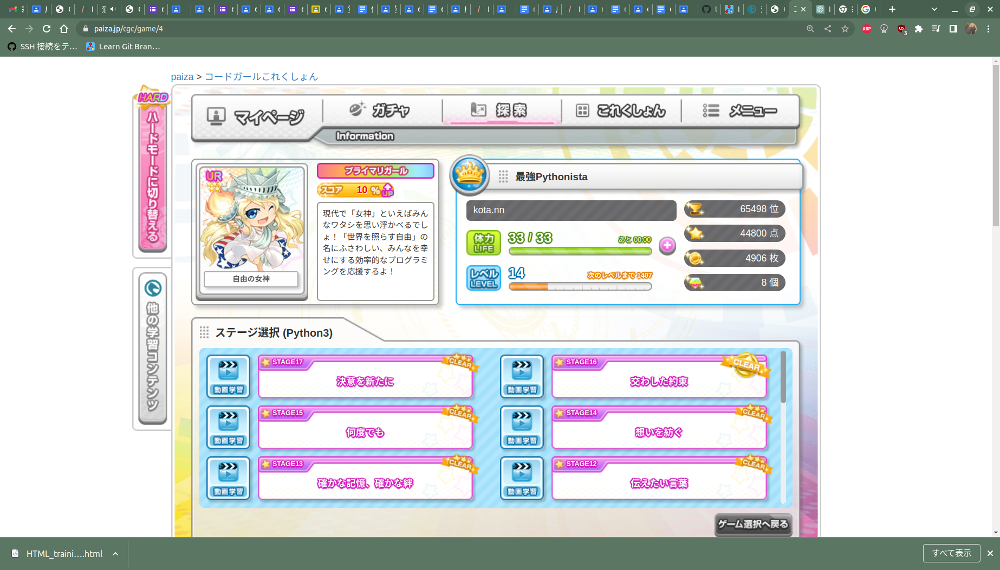

# paiza

# コードガールコレクション

# 恋するハッカソン

[ショートヘア](./lovehackathon/shorthair.py)

[ロングヘア](./lovehackathon/longhair.py)

[ポニーテール](./lovehackathon/ponytail.py)

[ツインテール](./lovehackathon/twintail.py)

[おさげ](./lovehackathon/osage.py)

[たれ目](./lovehackathon/tareme.py)

[つり目](./lovehackathon/turime.py)

[めがね](./lovehackathon/megane.py)

[cute衣装](./lovehackathon/cute.py)

[sexy衣装](./lovahackathon/sexy.py)

[制服](./lovehackathon/seihuku.py)

[浴衣](./lovehackathon/yukata.py)

[水着](./lovehackathon/mizugi.py)

[マイク](./lovehackathon/mic.py)

[カチューシャ](./lovehackathon/katyusya.py)

# プログラミングで彼女を作る

[つり目](./kanojo/turime.py)

[眼帯](./kanojo/gantai.py)

[猫耳](./kanojo/nekomimi.py)

[猫](./kanojo/nekoset.py)

[ショートヘア](./kanojo/shorthair.py)

[ロングヘア](./kanojo/longhair.py)

[ポニーテール](./kanojo/ponytail.py)

[ツインテール](./kanojo/twinteil.py)

[セーラー服](./kanojo/se-ra-huku.py)

[カーディガン](./kanojo/ka-dhigan.py)

[縞ニーソ](./kanojo/simani-so.py)

[メイド服](./kanojo/meidohuku.py)

